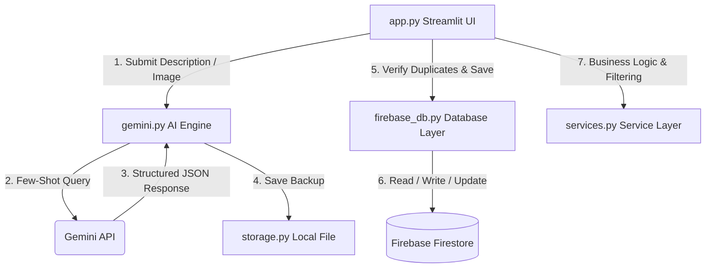

# CivicAI – Community Hero

CivicAI is a community-driven civic issue reporting and analytics dashboard. It empowers citizens to report public issues (e.g., road damage, water leaks, sanitation concerns) using text descriptions and/or image uploads. Gemini AI automatically analyzes the reports to extract category, severity, department workloads, resolution costs, and formal complaint summaries. A local proximity comparison prevents duplicate reporting. The project integrates an interactive map, community verification (voting) systems, Plotly charts, a contributor leaderboard, and predictive risk scoring.

---

## 1. Project Architecture

The system follows a clean, decoupled architecture:
1. **Frontend Presentation (`app.py`)**: Built with Streamlit, organizing the user interface into four tabs (Map & Reports, Analytics, Leaderboard, and Predictive Insights).
2. **Business Service Layer (`services.py`)**: Contains non-UI logic, including dynamic community health scoring, Plotly aggregation, issue filters, coordinate proximity calculations, and greedy geospatial clustering for hotspots.
3. **AI Engine (`gemini.py`)**: Interfaces with the Gemini API (`gemini-2.5-flash`) using few-shot structured prompting to analyze reports and generate narrative forecasts.
4. **Database Adapter (`firebase_db.py`)**: Handles transaction-safe writes, reads, status updates, and voting hooks in Firebase Firestore.
5. **Local Backup Store (`storage.py`)**: Writes copy logs of analyzed reports to a local JSON file (`data/issues.json`) as a fail-safe backup.

### Architecture Data Flow


---

## 2. Installation Guide

Follow these steps to run CivicAI locally:

### Prerequisites
* Python 3.9 or higher
* Firebase account and Firestore Database

### Step 1: Clone and Set Up Workspace
Ensure all project files are in your directory:
```bash
cd CivicAI
```

### Step 2: Create and Activate Virtual Environment
On Windows (PowerShell):
```powershell
python -m venv .venv
.venv\Scripts\Activate.ps1
```
On macOS/Linux:
```bash
python3 -m venv .venv
source .venv/bin/activate
```

### Step 3: Install Dependencies
Install all required libraries using the production-ready package configuration:
```bash
pip install -r requirements.txt
```

### Step 4: Configure Environment Variables
Create a `.env` file in the root directory and add your Gemini API key:
```env
GEMINI_API_KEY=your_gemini_api_key_here
```

### Step 5: Download Firebase Service Account Credentials
1. Go to your **Firebase Console**.
2. Select your project, then navigate to **Project Settings > Service Accounts**.
3. Click **Generate New Private Key**.
4. Save the downloaded JSON file as `firebase-key.json` in the root folder of this project.

---

## 3. Running the Application

### Start the Streamlit Dashboard
With the virtual environment active, execute:
```bash
streamlit run app.py
```
This will start a local web server and automatically open the application in your browser (usually at `http://localhost:8501`).

### Run Connectivity Tests
You can verify your database and AI API connections independently by running:
```bash
python test_firebase.py
python test_models.py
```

---

## 4. Production Readiness Checklist
* [x] **API Key Protection**: API keys are loaded via environmental variables (`.env`) and are excluded from console outputs (no logs print keys).
* [x] **Robust Error Handling**: Database timeouts, missing fields, or API limits are caught and reported via Streamlit warning containers.
* [x] **Firestore Optimization**: Active reports are streamed once per page-refresh and cached where possible, reducing billable database operations.
* [x] **No Duplicate Reports**: Geolocation proximity verification halts submission if an issue of the same category has been logged within 100 meters.
* [x] **Stateless Calculations**: Metrics and leaderboard tallies are fetched dynamically, keeping client states in sync.
